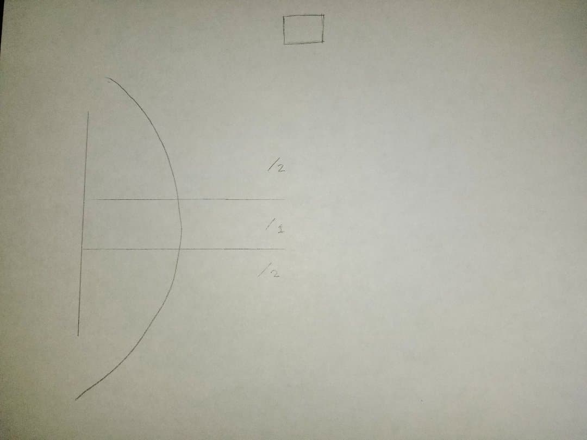
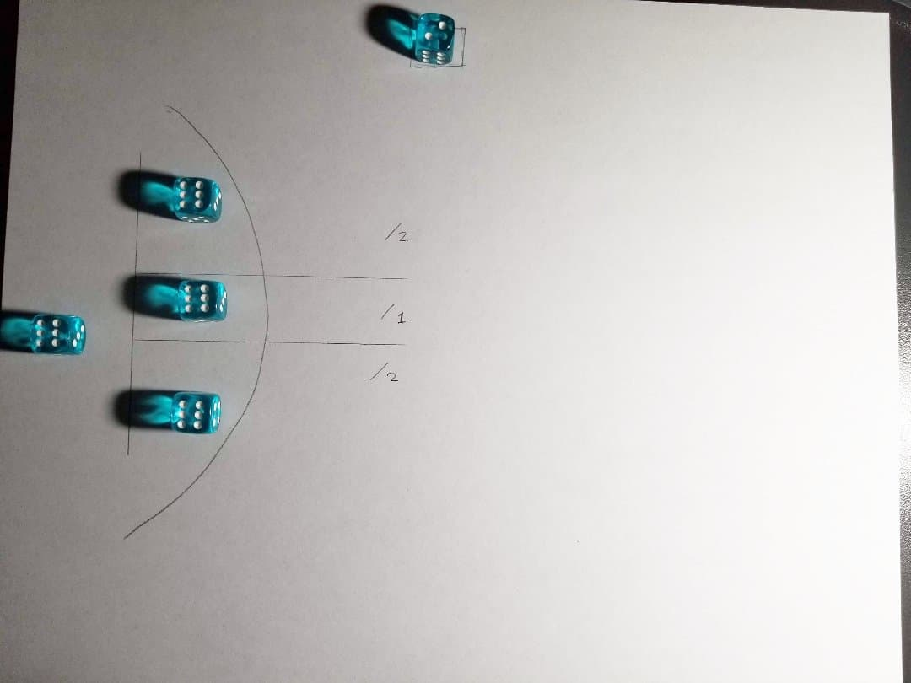

# Hold the Line

General Overview:
You are are an army, under siege.  Your castle walls have been crushed, and you must survive the impending waves of enemies from completely wiping out your armies.  
Fear not, however!  Your scouts have reported reinforcements coming.  All you need to do is hold the line!

###Overview:
* You will have a "breached castle" to deploy your "troops".  Your troops are represented by four dice.  
* Your goal is to survive a certain amount of turns, depending on the mode you choose.
* In your setup, three of the dice will be fielded(placed) on the corresponding top, middle, and bottom lanes.  
* You will have one die in the back line, representing your "reserve forces." 
* Enemies will come at you, represented by three dice, rolled one at a time, and placed rightward of your "troops."  The first, second, and third roll correspond to top, middle, bottom.
* The top and bottom lanes will halve the enemy's numbers/strength.  The middle is unaffected by any modifiers.
* During your battle, you simply "fight" by subtracting each of your soldier's die values by the number of the enemy's die values, for each lane. 
* If one lane's die value is too low for comfort, or completely gone, you can divert up to your current "backline" die value to replenish your front line.  Then decrease or remove the backline completely.
* If you have no more of a backline, you lose.
* Once the turn is over, you decrease the countdown die at the very top, by 1.  If it becomes zero, you win and survive!

###Setup:
1. Draw your map.
	* For fun, draw an entire scene of a castle!  But you can just draw the diagram.
2. Choose a mode:
	* Easy Mode: Set a die at the very top of your map to 2.
	* Normal Mode: Set a die at the very top of your map to 3.
	* Hard Mode: Set a die at the very top of your map to 4.
	* M'Lord, the Scouts have returned! : Roll a die to determine the number of turns to survive.
3. Place each quadrant with a 6-facing die on top. 

## Diagram Map

## Map filled with dice

###Turn Order:
1. Reinforce
	* Decide whether you want to reinforce your front line with your backline.
	* Subtract your back-line by the amount you wish to reinforce your front line.  
	* Add to your front line (either top, middle, bottom, or a mix) the amount you subtracted.
	* If your backline is 0, then remove the die completely from the back.
2. Scout
	* For each lane, top to bottom, roll one die. 
	* Then place the die (or number) in that corresponding field.
	* Swap places of your current die fields if desired.
3. Battle 
	* In the top and bottom lanes, halve the die value, rounding up.
	* Subtract the enemy numbers from your soldier's numbers.
	* If any subtraction results negatively, subtract that value from the backline.
		* If the backline die is zero or negative, you lose.
4. Results
	* If you have survived the current wave, decrease the top die by one.
	* Then, if you have one or more of your backline die, then increase it by one.
	* If you have reached zero waves, then congratulations, you've won!

Use [Markdown](https://en.wikipedia.org/wiki/Markdown) to format your document. There is a [GitHub specific guide](https://guides.github.com/pdfs/markdown-cheatsheet-online.pdf) that you can download to your computer.

Create a new(-ish) traditional-style game that can be played with common household materials. Please exclude any designs that use alcohol, controlled substances, or can cause physical/emotional pain. Provide instructions on how to play your game and a list of materials needed to play your game. Please illustrate your instructions.

In the README.md you shall:
* give general overview of the game
* describe objectives and strategies
* provide the rules and an explanation of the rules
* illustrate the game, game pieces, application of the rules, etc.

In materials.md you shall list all the materials needed to make the game.

The directory named images should contain all the images you wish to use in the document. You can show images in a Markdown file very easily.

Use a digital camera or smart phone camera to show how to play your game.
