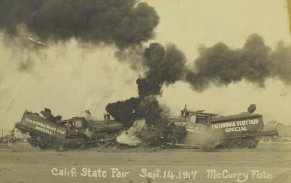

# Hold the Line

General Overview:
You are are an army, under siege.  Your castle walls have been crushed, and you must survive the impending waves of enemies from completely wiping out your armies.  
Fear not, however!  Your scouts have reported reinforcements coming.  All you need to do is hold the line!

Setup:
1. Draw your map.
2. Roll one die and put that on top of your "map".  That is the amount of turns you must last.
3. Place each quadrant with a 6-facing die on top. 

Turn Order:
1. Reinforcement 
	* Decide whether you want to reinforce your front line with your backline.
	* Subtract your back-line by the amount you wish to reinforce your front line.  
	* Add to your front line (either top, middle, bottom, or a mix) the amount you subtracted.
	* If your backline is 0, then remove the die completely from the back.
2. Scout Enemy Forces
	* For each lane, top to bottom, roll one die.  
	* Then place the die (or number) in that corresponding field.
3. Battle 
	* Subtract the enemy numbers from your soldier's numbers.
4. Results
	*

Use [Markdown](https://en.wikipedia.org/wiki/Markdown) to format your document. There is a [GitHub specific guide](https://guides.github.com/pdfs/markdown-cheatsheet-online.pdf) that you can download to your computer.

Create a new(-ish) traditional-style game that can be played with common household materials. Please exclude any designs that use alcohol, controlled substances, or can cause physical/emotional pain. Provide instructions on how to play your game and a list of materials needed to play your game. Please illustrate your instructions.

In the README.md you shall:
* give general overview of the game
* describe objectives and strategies
* provide the rules and an explanation of the rules
* illustrate the game, game pieces, application of the rules, etc.

In materials.md you shall list all the materials needed to make the game.

The directory named images should contain all the images you wish to use in the document. You can show images in a Markdown file very easily.

Use a digital camera or smart phone camera to show how to play your game.
